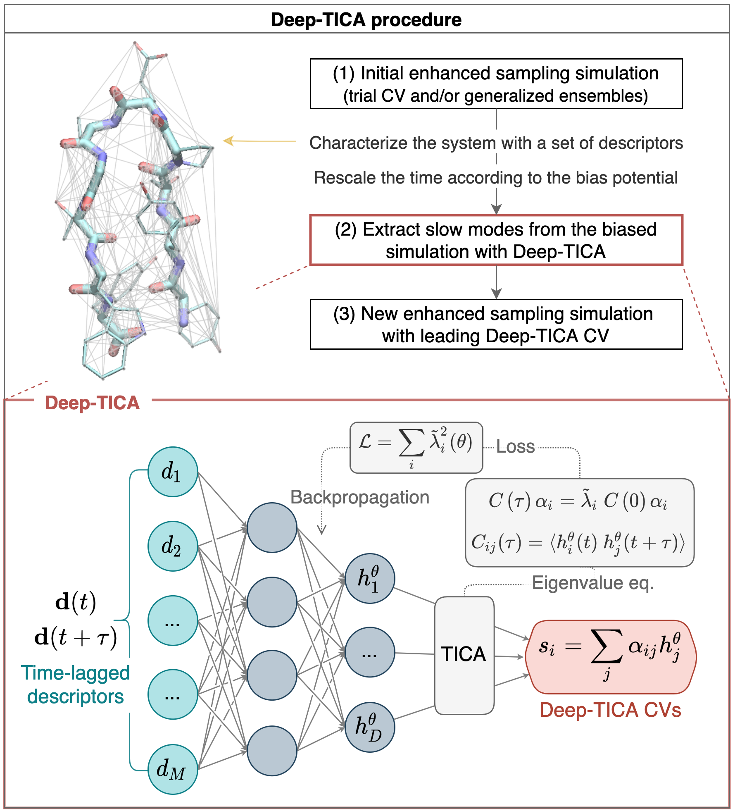

## Theoretical Framework, TICA time-lagged independent component analysis  

<!--  for math formulas -->

From a *Molecular Dynamics* simulation we obtain a set of points  which define a trajectory in the Phase Space  of the system, where N is the total number of simulation steps.  
These points are distributed according to a certain probability distribution . If the simulation is sufficiently long and the system is ergodic then (in the canonical ensemble NPT)  is the Boltzmann one. Strictly speaking we can say that during the simulation the distribution probability evolves in time and the stationary distribution  is the Boltzmann distribution:   

### Transfer operator
It is possible to formalize this statement by the definition of the transfer operator : given a  then 
Denoting with  its eigenfunctions, and with  its eigenvalues it is possibile to rewrite the expression above as follows: 
As  all the contributes vanish but the one relative to  which is exactly the Boltzmann distribution , the fixed point of , 
  
### TICA Analysis  
The aim of TICA analysis is to diagonalize  and express its action on a probability distribution through its eigenfunctions and eigenvalues. In this way by applying infinite times  to  one finally obtains the form of :
  
Where 
In order to diagonalize this operator we must consider a subset of the all eigenfunctions, such that we can work in a finite dimensional vector space. Suppose we are interested in the first m slow modes of the system. With this choice we are assuming that all the other slow modes are those with a timescale much smaller than , for i>m.  
Then it is clear that  defines which are the slow modes we are interested in. But in principle we do not know the slow modes of the system and their timescales.  

### Linear approximation and TICA
How can we guess the  ? 
To answer this question we first recall what TICA does:   
It uses a linear transformation to map an original order parameters  set to a new set of order parameters , the *Independent component*.  must fullfill two properties:  
1.  they are uncorrelated. This means that 
2.  Their autocovariances at a fixed lag time  are maximal  
If  are the  eigenfunctions, then   
  
We consider a basis set formed by the so called *descriptors* . Then we assume that each  can be written as a linear combination of   
With this approximation the problem of finding  (of maximizing ) becomes a general eigenvalue problem to find 
where  and 
  
Condition 1. requires that there is not overlap between  and , and that  is symmetric. Obviously this condition it is not satisfied from the data, which are obtained from an finite simulation, so we must enforce this condition.  

# Deep-TICA  

